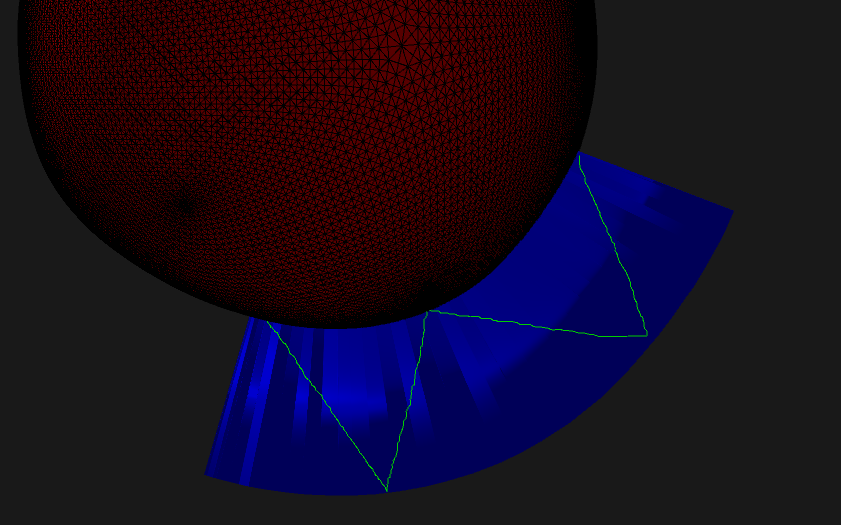
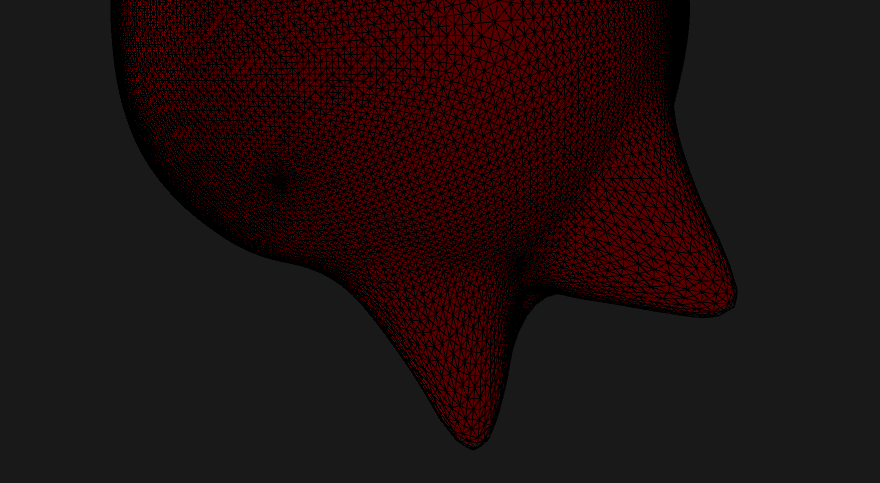

# Catmul-clark subdivision
```by Mohammad Fakhreddin```

Demo project that you can draw on surfaces.

# Report

## Demo

There is a mp4 video that showcases how my implementation works.

<image src="example5.png" style="width:500px"></image>
<image src="example6.png" style="width:570px"></image>

<!-- { width=50% } -->

<!-- { width=50% } -->

## Ray casting.

As the user sketches on the screen, the mouse position transitions from screen space to projected space. Subsequently, I determine the world space coordinates for the mouse position by multiplying it with the inverse of the view and projection matrix. The ray direction is then calculated based on the mouse position and the camera position. Utilizing the ```ray-triangle``` intersection algorithm I sample points on the surfaces of triangles.

## Catmul-clark subdivision

The Catmull-Clark subdivision is executed within the ```Subdivision.hpp``` file. To implement the subdivision, I employed the ```half-edge data``` structure from the ```geometry-central``` library. Simultaneously, during the subdivision of the mesh, I gather the contributions of the points from the previous level to the next level for surface fitting.

## Curtain interface

I've implemented the curtain interface, allowing users to draw any pattern on the mesh. By utilizing sampled points and the user-defined curtain height, I generate a mesh for the curtain in the direction of the surface normal. The implementation details can be found in ```CurtainMeshRenderer.hpp```

## Curve fitting

I begin by calculating the contribution to the sample points from the points within the triangle using barycentric coordinates. Subsequently, considering the subdivision level (as indicated by the Effect level of subdivision in the ImGui) and utilizing the pre-computed contributions from the previous level to the next level, as discussed in the subdivision section of this report, I replace the current level points with those from the previous level. Additionally, I multiply the existing contribution value by the contribution value from the previous level to the next level.

## Laplacian

I categorized the points into two groups: movable points and all the points. After computing the affected points at the target subdivision level (e.g., if we are at level 8 and want subdivision on level 6), I gather nearby neighbors within a specified distance set by the user. All neighboring points, excluding those on the boundary, can contribute to the D matrix as outlined in the paper. This exclusion is intentional to ensure a smooth connection from the deformed area to the rest of the mesh. 

## bdcSVD solver

I employed the ```Eigen::bdcSVD solver``` to address the equation. The left-hand side is derived by combining the B and Y matrices with a weight of 0.9. I iteratively solved this equation three times, once for each component (x, y, and z) of the points. The implementation details are available in ```CC_SubdivisionApp.cpp```.

# How to install dependencies

You need to install vulkan and sdl. I explained the steps for vcpkg but you use any other way to install and link these 2 libraries. Just make sure that vulkan-sdk is installed on your pc.

## using vcpkg

### To install vcpkg:
```
https://vcpkg.io/en/getting-started.html
```
### Dependencies

#### For windows:

To install vulkan:
```
vcpkg install vulkan:x64-windows
```
```For linux replace the windows with linux```

To install sdl2:
```
vcpkg install sdl2[vulkan] --triplet x64-windows
```
```For linux replace the windows with linux```

#### For linux:

To install vulkan:
```
vcpkg install vulkan:x64-windows
```
```For linux replace the windows with linux```

To install sdl2:
```
vcpkg install sdl2[vulkan] --triplet x64-windows
```

### Link vcpkg to your project

Add vcpkg to toochain and then run 
```
cmake .. -DCMAKE_TOOLCHAIN_FILE=[path to vcpkg]/scripts/buildsystems/vcpkg.cmake
```

# How to build

Create a directory a build directory instead the project folder and change directory to that folder then execute following command:

## For make, ninja, etc

For release build:
```
cmake -DCMAKE_BUILD_TYPE=Release ..
```
For debug build:
```
cmake -DCMAKE_BUILD_TYPE=Debug ..
```
## For visual studio
```
cmake ..
```

You can use visual studio (recommended) or ninja on windows. For linux use the unix makefiles to run the project. 

### PDF generated by pandoc
```
 pandoc Solution.md -o Solution.pdf
```

To install pandoc:
```
sudo apt-get install texlive-latex-base texlive-fonts-recommended texlive-fonts-extra texlive-latex-extra
```
```
sudo apt-get install pandoc
```